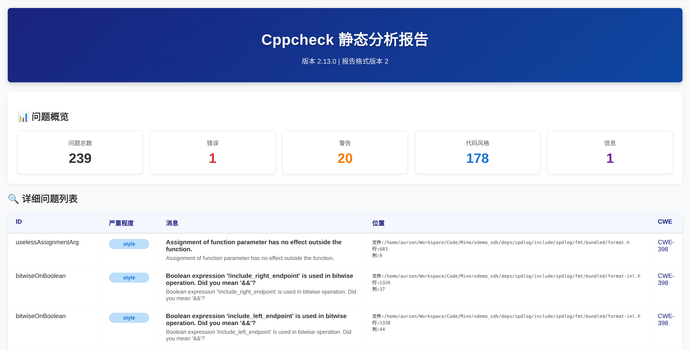
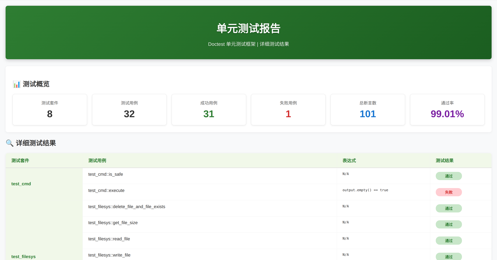

```text
          ___                 _______  __ __
         / _ \___ __ _  ___  / __/ _ \/ //_/
        / // / -_)  ' \/ _ \_\ \/ // / ,<   
       /____/\__/_/_/_/\___/___/____/_/|_|  
```

<p align="lift">
    <a href="#Language" alt="Language"></a>
    <a href="#arch" alt="arch"></a>
    <a href="#platform" alt="platform"></a>
</p>

# 索引

[📑 1. 项目简介](#项目简介)

[📒 2. 目录结构](#目录结构)

[💻 3. 开发环境](#开发环境)

[🔨 4. 编译代码](#编译代码)

[🔎 5. 静态检查](#静态检查)

[💯 6. 单元测试](#单元测试)

[✅ 7. 完成情况](#完成情况)

[🖥️ 8. 开发指南](#开发指南)

***

## 项目简介
这是一个<font color = green> Linux C++ SDK</font>的 Demo。

## 目录结构

```bash
.
├── cmake/
│  ├── ToolchainArm64   # 编译器配置
│  ├── ToolchainX64     # 编译器配置
│  └── bottom/  # 一些底层 cmake 代码
├── deps/       # 第三方库
├── doc/        # 文档或者文档需要的素材
├── example/    # 示例
├── includ/e    # 头文件
├── src/        # 源代码
├── test/       # 单元测试
├── tool/       # 一些脚本工具
├── xslt/       # 一些用于生成 html 的模板
└── build.sh    # 编译脚本
```

## 开发环境

### X64

```bash
sudo apt update
sudo apt install gcc g++ cmake make xsltproc cppcheck
```
### Arm64

安装自己的交叉编译器，在 `cmake/ToolchainArm64.cmake` 里配置就行。

## 编译代码

### 自动编译

如果不带参数编译，默认的构建类型为 Release, 默认的目标平台是 X64

```bash
$ ./compile.sh -h
用法: ./compile.sh [-b <构建类型>] [-p <平台>]
选项:
  -b, --build-type   指定构建类型 (Debug|Release), 默认: Release
  -p, --platform     指定目标平台 (X86|X64|Arm64), 默认: X64
  -h, --help         显示此帮助信息

示例: ./compile.sh -b Release -p X86
```

在项目根目录运行编译脚本即可编译

```bash
# 编译
./compile.sh -b Release -p X64
```

### 手动编译
编译前先创建一个 build 目录，并生成 makefile，操作如下（在项目根目录执行）:

1. 生成 makefile

```bash
mkdir -p build && cd build
cmake -DCMAKE_BUILD_TYPE=Release ..
# 或者
cmake -DCMAKE_BUILD_TYPE=Debug ..
# 如果是使用交叉编译器，请在 cmake 文件里配置并指定配置
cmake -DCMAKE_BUILD_TYPE=Release -DCMAKE_TOOLCHAIN_PATH=../cmake/ToolChain.cmake ..
```
2. 编译示例
```bash
make example # ls ./bin
```

3. 编译并打包 sdk
```bash
make pack # ls ./install
```

4. 编译单元测试
```bash
make test # ls ./test
```

## 静态检查

一键扫描并生成测试报告

```bash
../tool/cppcheck_report.sh
```


## 单元测试
本项目采用 doctest 实现单元测试；doctest 是一个超轻量级的单元测试框架；可以实现多个测试套件（测试用例集），一个测试套件可以包含多个用例，测试时可以灵活控制要测试哪些用例或者哪些套件。

### 自动测试

```bash
../tool/test_report.sh # 一键测试并生成报告
```


### 手动测试

```bash
./test/test_xdemo_sdk --help    # 查看所有用法
./test/test_xdemo_sdk -lts      # 列出所有套件
./test/test_xdemo_sdk -ltc      # 列出所有用例
./test/test_xdemo_sdk -lts=xxx  # 复制列出来的测试套件，粘贴代替 xxx 即可测试某个套件
./test/test_xdemo_sdk -ltc      # 复制列出来的测试用例，粘贴代替 xxx 即可测试某个用例
./test/test_xdemo_sdk           # 测试所有用例
```

## 完成情况

+ [X] git commit 强制检查;
+ [X] cppcheck 扫描并生成可视化报告;
+ [X] doctest 单元测试并生成可视化测试报告;
+ [X] SDK 同时支持 C 语言 和 C++ 接口;
+ [X] 常用文件操作函数;
+ [X] MD5 校验接口;
+ [X] 线程安全队列;
+ [X] 高性能线程安全环形缓冲区;
+ [X] 单例模板;
+ [X] 线程常用操作;
+ [X] 程序耗时计算;
+ [X] 常用时间获取接口;
+ [X] 高性能异步日志 spdlog 封装;
+ [X] 常用宏函数;
+ [X] 系统命令调用接口;
+ [ ] 串口操作

## 开发指南
TODO： [wiki](https://github.com/cseek/xdemo_sdk/wiki)

***
👩‍💻 <font color = red> 问题反馈: </font> jassimxiong@gmail.com

<p align="lift">Copyright (c) 2025 by Aurson, All Rights Reserved.<p>
